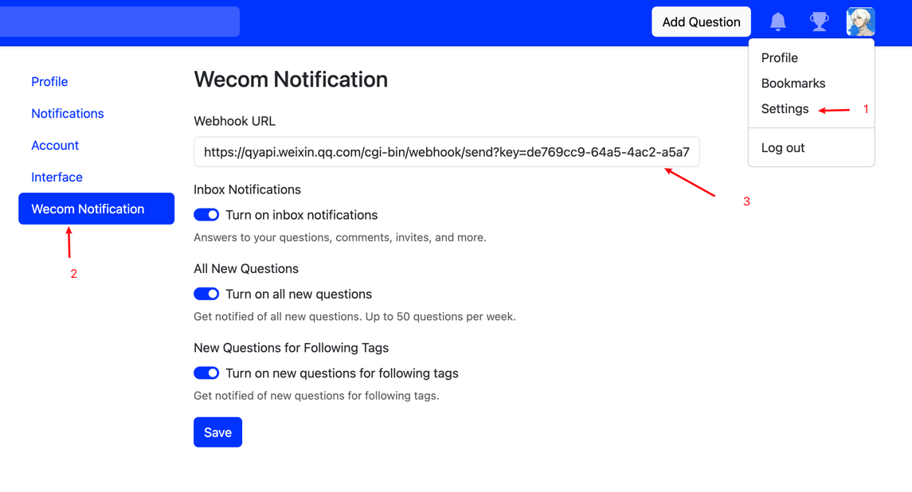

# 企业微信通知插件

[English](./README.md) | [中文](./README_CN.md)

## 使用指南

要使用通知企业微信通知插件，请使用以下命令进行安装：

```bash
./answer build --with github.com/apache/answer-plugins/notification-wecom
```


## 功能

- 通过企业微信群机器人发送信息到企业微信

## 配置

> 配置Webhook URL并打开通知

- Webhook 地址: 类似于 `https://qyapi.weixin.qq.com/cgi-bin/webhook/send?key=xxxxxxxx-xxxx-xxxx-xxxx-xxxxxxxxxxxx`

## 预览



## 开发文档

https://open.work.weixin.qq.com/help2/pc/14931
https://developer.work.weixin.qq.com/document/path/91770

## 致谢

感谢钉钉通知插件的开发，本插件很多代码参考或者直接沿用了钉钉通知插件的代码。